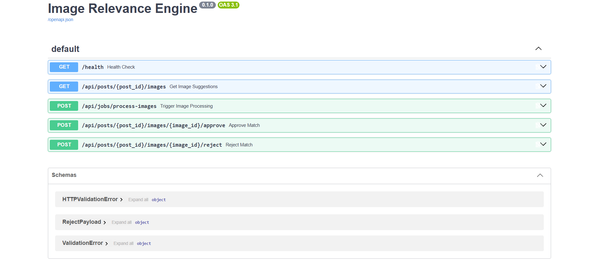
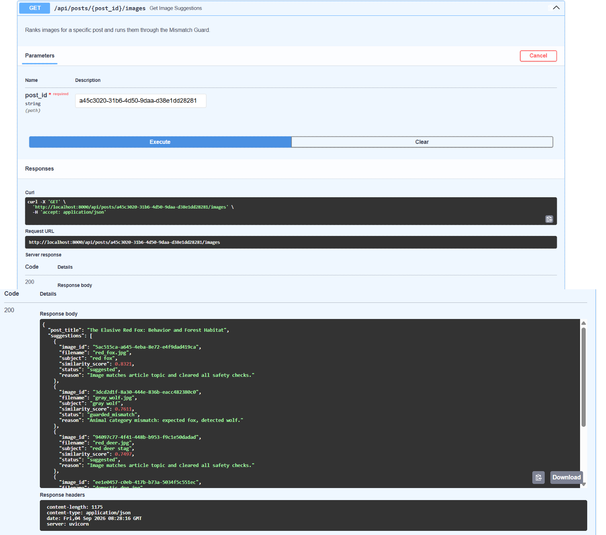
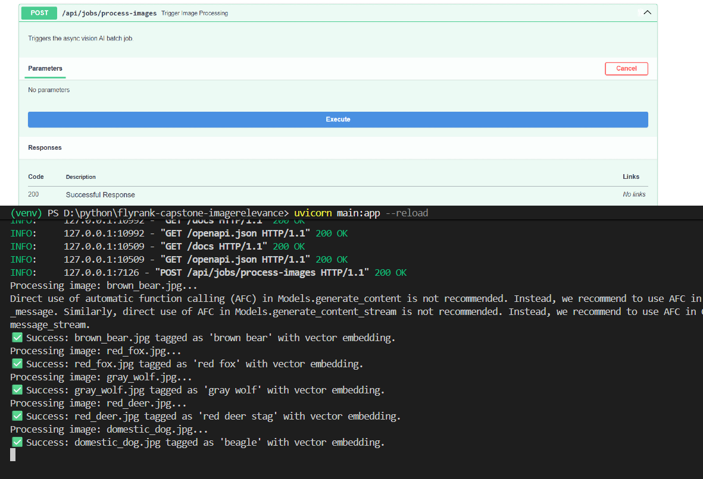
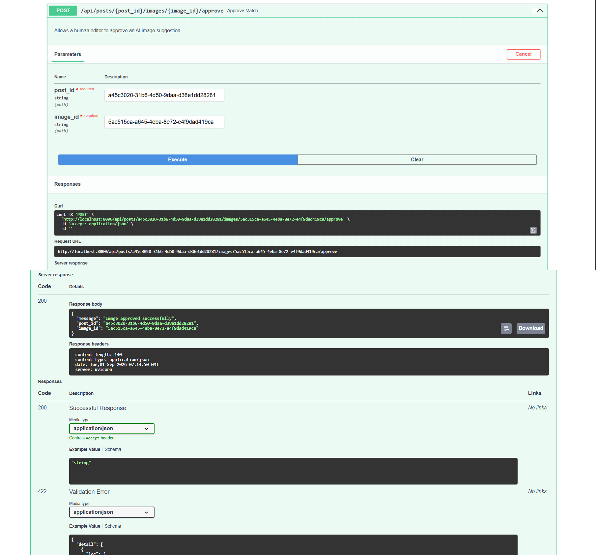
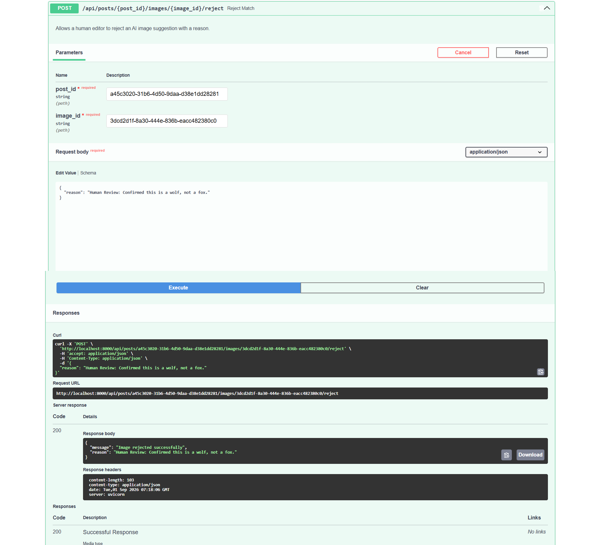

# AI Image Understanding & Content Matching Engine

An AI-powered image understanding and semantic content matching system built with **Python, FastAPI, PostgreSQL, pgvector, and Gemini**.

The system analyzes uploaded images with a multimodal Gemini model, extracts structured visual metadata, generates embeddings, stores those embeddings in PostgreSQL using pgvector, and uses vector similarity to find relevant content matches. A mismatch guard helps prevent obviously unrelated image/content matches.

## What the System Does

The pipeline works in the following stages:

1. **Image ingestion**
   - Images are placed in the configured image/input directory.
   - The processing job identifies pending images.

2. **Image understanding**
   - Gemini analyzes each image.
   - The response is constrained to a Pydantic schema containing:
     - `subject`
     - `category`
     - `attributes`
     - `caption`
     - `confidence`

3. **Text embedding**
   - The generated image metadata/caption is converted into a semantic embedding using Gemini's embedding model.
   - The project uses a **768-dimensional vector representation** for PostgreSQL/pgvector matching.

4. **Vector storage**
   - Embeddings are stored in PostgreSQL.
   - The `pgvector` extension provides vector storage and similarity-search functionality.

5. **Semantic matching**
   - Image/content embeddings are compared using vector similarity.
   - The system retrieves relevant candidate content.

6. **Mismatch Guard**
   - Candidate matches are checked to reduce clearly incorrect semantic matches.

7. **Review / evaluation**
   - Matches can be reviewed through the API.
   - The project includes evaluation functionality for measuring matching quality, including Top-1 Precision.

---

## Architecture

```text
                        ┌─────────────────────┐
                        │     Input Images    │
                        │  JPG / PNG / etc.   │
                        └──────────┬──────────┘
                                   │
                                   ▼
                        ┌─────────────────────┐
                        │     FastAPI API     │
                        │  Upload / Job APIs  │
                        └──────────┬──────────┘
                                   │
                                   ▼
                     ┌──────────────────────────┐
                     │   Image Processing Job   │
                     │   process_pending_images │
                     └────────────┬─────────────┘
                                  │
                                  ▼
                     ┌──────────────────────────┐
                     │       Gemini Vision      │
                     │   Image Understanding    │
                     └────────────┬─────────────┘
                                  │
                         Structured metadata
                                  │
                                  ▼
                     ┌──────────────────────────┐
                     │    Metadata / Database   │
                     │   PostgreSQL + SQLAlchemy │
                     └────────────┬─────────────┘
                                  │
                                  ▼
                     ┌──────────────────────────┐
                     │    Gemini Embeddings     │
                     │   Semantic Representation │
                     └────────────┬─────────────┘
                                  │
                         768-d vector
                                  │
                                  ▼
                     ┌──────────────────────────┐
                     │ PostgreSQL + pgvector    │
                     │ Vector Similarity Search │
                     └────────────┬─────────────┘
                                  │
                                  ▼
                     ┌──────────────────────────┐
                     │    Candidate Matching   │
                     │      + Mismatch Guard   │
                     └────────────┬─────────────┘
                                  │
                                  ▼
                     ┌──────────────────────────┐
                     │       Review API         │
                     │ Approve / Reject Matches │
                     └────────────┬─────────────┘
                                  │
                                  ▼
                     ┌──────────────────────────┐
                     │      Evaluation          │
                     │      Top-1 Precision     │
                     └──────────────────────────┘
```

### High-Level Flow

```text
Image
  ↓
Gemini Vision
  ↓
Structured Metadata
  ↓
Embedding
  ↓
PostgreSQL + pgvector
  ↓
Vector Similarity Search
  ↓
Mismatch Guard
  ↓
Candidate Match
  ↓
Human Review / Evaluation
```

---

## Tech Stack

| Component | Technology |
|---|---|
| Language | Python |
| API | FastAPI |
| Database | PostgreSQL |
| Vector Database | PostgreSQL + pgvector |
| ORM | SQLAlchemy |
| Database Migrations | Alembic |
| Vision / Multimodal AI | Gemini |
| Embeddings | Gemini Embedding Model |
| Schema Validation | Pydantic |
| Image Processing | Pillow |
| Server | Uvicorn |
| Containerization | Docker / Docker Compose |

---

## Project Structure

```text
flyrank-capstone-imagerelevance/
│
├── app/
│   ├── config.py
│   ├── database.py
│   ├── model.py
│   ├── jobs.py
│   │
│   └── services/
│       ├── vision.py
│       └── embedding.py
│
├── alembic/
│   ├── versions/
│   └── env.py
│
├── main.py
├── seed_posts.py
├── clean.py
├── docker-compose.yml
├── alembic.ini
├── requirements.txt
├── .env
└── README.md
```

---

# Setup

## 1. Clone the Repository

```bash
git clone <YOUR_REPOSITORY_URL>
cd flyrank-capstone-imagerelevance
```

## 2. Create a Virtual Environment

On Windows:

```powershell
py -3.10 -m venv venv
```

Activate it:

```powershell
.\venv\Scripts\Activate.ps1
```

Install dependencies:

```powershell
pip install -r requirements.txt
```

> Python 3.11+ is recommended for future compatibility with Google's Python packages.

---

# Database Setup

The project uses PostgreSQL with the **pgvector** extension.

## 3. Start PostgreSQL with Docker

Make sure Docker Desktop is running.

```powershell
docker compose up -d
```

Check the container:

```powershell
docker ps
```

The expected database setup is:

```text
PostgreSQL
    ↓
pgvector extension
    ↓
flyrank database
```

### Important: Port Configuration

The application must use the same host port exposed by Docker.

For example, if `docker-compose.yml` contains:

```yaml
ports:
  - "5432:5432"
```

then the application should connect using:

```text
localhost:5432
```

If your `.env` uses `localhost:5433` while Docker exposes `5432`, the application will fail with:

```text
psycopg2.OperationalError:
connection to server at "localhost", port 5433 failed:
Connection refused
```

Make sure these values match.

---

# Environment Variables

Create a `.env` file in the project root.

Example:

```env
DATABASE_URL=postgresql://postgres:<PASSWORD>@localhost:5432/flyrank
GEMINI_API_KEY=<YOUR_GEMINI_API_KEY>
```

Do **not** commit `.env` or your Gemini API key to Git.

Add it to `.gitignore`:

```gitignore
.env
venv/
__pycache__/
```

---

# Database Migration

The project uses Alembic for database schema management.

After starting PostgreSQL:

```powershell
alembic upgrade head
```

The migration creates the required database tables and enables the PostgreSQL `vector` extension before creating vector columns.

This is important because columns such as:

```text
embedding VECTOR(768)
```

require the pgvector extension to exist first.

---

# Run the API

Start FastAPI using:

```powershell
uvicorn main:app --reload
```

The API will run at:

```text
http://127.0.0.1:8000
```

Health check:

```text
GET /health
```

You can open:

```text
http://127.0.0.1:8000/health
```

Expected response:

```json
{
  "status": "ok",
  "database_connected": true,
  "gemini_configured": true
}
```

---

# Seed Blog Posts

Before testing semantic matching, seed the database with the sample blog posts.

Run:

```powershell
python seed_posts.py
```

The script generates embeddings for the seeded text content and stores them in PostgreSQL.

Expected output is similar to:

```text
Seeding blog posts and generating text embeddings...
```

---

# Process Images

Start the FastAPI server:

```powershell
uvicorn main:app --reload
```

Then trigger the image processing endpoint:

```text
POST /api/jobs/process-images
```

The processing pipeline will:

```text
Image
 ↓
Gemini Vision
 ↓
Metadata
 ↓
Embedding
 ↓
PostgreSQL
 ↓
Vector Matching
```

Example successful processing output:

```text
Processing image: brown_bear.jpg...
✅ Success: brown_bear.jpg tagged as 'brown bear' with vector embedding.

Processing image: red_fox.jpg...
✅ Success: red_fox.jpg tagged as 'red fox' with vector embedding.

Processing image: gray_wolf.jpg...
✅ Success: gray_wolf.jpg tagged as 'gray wolf' with vector embedding.

Processing image: red_deer.jpg...
✅ Success: red_deer.jpg tagged as 'red deer stag' with vector embedding.

Processing image: domestic_dog.jpg...
✅ Success: domestic_dog.jpg tagged as 'beagle' with vector embedding.
```

---

# Complete Run Order

For a fresh local setup, the recommended order is:

### Terminal 1 — Start PostgreSQL

```powershell
docker compose up -d
```

### Terminal 2 — Activate environment

```powershell
.\venv\Scripts\Activate.ps1
```

### Run migrations

```powershell
alembic upgrade head
```

### Seed content

```powershell
python seed_posts.py
```

### Start API

```powershell
uvicorn main:app --reload
```

### Trigger image processing

Use:

```text
POST /api/jobs/process-images
```

Then inspect the generated matches through the project's matching/review endpoints.

---

# Resetting Seed/Test Data

The project contains `clean.py` for clearing seeded/test database records.

Run:

```powershell
python clean.py
```

Make sure PostgreSQL is running before executing the script.

If you see:

```text
connection to server at "localhost", port 5433 failed:
Connection refused
```

check the `DATABASE_URL` in `.env` and make sure it matches the Docker port.

---

# Gemini Configuration

The project uses Gemini for two AI tasks:

### 1. Multimodal image understanding

Gemini receives an image and returns structured metadata.

The expected schema is:

```json
{
  "subject": "brown bear",
  "category": "animal",
  "attributes": [
    "brown fur",
    "large mammal",
    "wild animal"
  ],
  "caption": "A brown bear standing outdoors.",
  "confidence": 0.95
}
```

### 2. Semantic embeddings

The extracted textual information is converted into a vector representation.

The project expects a **768-dimensional embedding** for the pgvector column.

---

# Cost Tracking

The system records token usage and estimated AI cost for audit/evaluation purposes.

The cost values are estimates used for project-level tracking and should **not** be interpreted as an exact billing statement.

The actual cost depends on the Gemini model, pricing tier, account configuration, and current provider pricing.

---

# Limitations

This project is a capstone/prototype system and has several important limitations.

### 1. Gemini API quotas

The system depends on Gemini API availability and quota limits.

During development, the Gemini free tier returned HTTP `429` errors after the project's available request quota was exhausted.

For example:

```text
429 You exceeded your current quota
Quota exceeded for:
generate_content_free_tier_requests
```

Changing an API key does not necessarily provide a new quota because quotas can be associated with the underlying project/account rather than simply the key.

Therefore, image processing may fail when the configured Gemini quota is exhausted.

### 2. External AI dependency

The image understanding and embedding stages depend on Google's Gemini API.

If the API is unavailable, rate-limited, deprecated, or incorrectly configured, the corresponding pipeline stage cannot run.

### 3. Model/API changes

The project originally used the older:

```python
google.generativeai
```

package.

Google has deprecated that package and recommends the newer:

```python
google.genai
```

SDK.

The codebase therefore needs to remain aligned with the currently supported Gemini SDK and model names.

### 4. Embedding model compatibility

Gemini embedding model names and API behavior can change.

The project must use an embedding model that is currently available and supports the required embedding operation and dimensionality.

### 5. AI-generated metadata is not guaranteed to be correct

Gemini's classification is probabilistic.

For example, visually similar animals may occasionally be classified incorrectly.

The confidence value returned by the model should therefore be treated as an AI estimate rather than a mathematically guaranteed probability.

### 6. Similarity does not mean correctness

A high vector similarity score indicates semantic closeness, but it does not guarantee that a match is factually correct.

This is why the project includes a mismatch guard and human review functionality.

### 7. Local development configuration

The documented setup is intended primarily for local development.

Production deployment would require additional work around:

- Authentication and authorization
- Secrets management
- Rate limiting
- Background job infrastructure
- Monitoring and logging
- Database backups
- Retry policies
- API security
- Horizontal scaling
- Production deployment configuration

### 8. Cost estimation

The project logs estimated token/cost values for audit purposes. These are approximate calculations and are not a replacement for provider billing information.

---

# Evaluation

The project includes evaluation functionality to measure matching quality.

One important metric is:

```text
Top-1 Precision
```

This evaluates whether the highest-ranked candidate returned by the matching system is the correct/relevant content.

The evaluation layer is intended to provide a measurable indication of matching performance rather than relying only on visual inspection.

---

# Key Design Decisions

### PostgreSQL + pgvector

Instead of introducing a separate vector database, embeddings are stored alongside application data in PostgreSQL.

Benefits:

- One database for relational and vector data
- SQL-based similarity queries
- Easy local development
- Simple deployment architecture
- Good fit for the scale of this capstone

### Pydantic Schema Validation

Gemini's vision response is constrained to a structured schema so the application does not depend on arbitrary free-form model output.

### Mismatch Guard

Vector similarity alone can produce semantically plausible but incorrect matches.

The mismatch guard adds an additional validation layer before accepting a candidate.

### Human Review

AI matching should not always be treated as final.

The review API provides a mechanism for a human to approve or reject a generated match.

---

# Current Status

The core pipeline has been implemented:

- [x] FastAPI application
- [x] PostgreSQL database
- [x] pgvector integration
- [x] Alembic migrations
- [x] Gemini image understanding
- [x] Structured Pydantic metadata
- [x] Gemini embeddings
- [x] Vector similarity matching
- [x] Mismatch guard
- [x] Image processing job
- [x] Seed data
- [x] Review API
- [x] Matching evaluation
- [x] Top-1 Precision evaluation
- [x] Cost/token tracking
- [x] README/reproducibility documentation

---

# Example End-to-End Pipeline

```text
brown_bear.jpg
      │
      ▼
Gemini Vision
      │
      ▼
"brown bear"
"animal"
"brown fur"
...
      │
      ▼
Text Embedding
      │
      ▼
768-dimensional vector
      │
      ▼
PostgreSQL + pgvector
      │
      ▼
Cosine Similarity Search
      │
      ▼
Candidate Blog Posts
      │
      ▼
Mismatch Guard
      │
      ▼
Relevant Match
      │
      ▼
Human Review
      │
      ▼
Evaluation
```

---

# Notes for Reproducibility

For a clean demonstration:

1. Start Docker.
2. Verify PostgreSQL is running.
3. Verify `DATABASE_URL`.
4. Verify `GEMINI_API_KEY`.
5. Run Alembic migrations.
6. Seed the blog posts.
7. Start FastAPI.
8. Process the sample images.
9. Review the generated matches.
10. Run the evaluation.

If Gemini quota is exhausted, the database and application can still be inspected, but new AI-generated image metadata/embeddings cannot be generated until the applicable quota becomes available or a properly configured alternative is used.

---

## API Documentation — Swagger UI

The backend provides interactive API documentation through Swagger UI.

### Swagger Endpoints



The Swagger UI provides access to the available REST API endpoints, including:

- Health check
- Image processing
- Post image suggestions
- Match approval
- Match rejection

### OpenAPI Documentation

When the FastAPI server is running, Swagger UI is available at:

`http://localhost:8000/docs`

You can use Swagger UI to inspect request/response schemas and test the API endpoints directly.

---

## API Documentation — Swagger UI


### Image Suggestions API



### Image Processing API



### Review API






---

## License

This project was developed as an AI/Backend engineering capstone project for learning, evaluation, and demonstration purposes.
